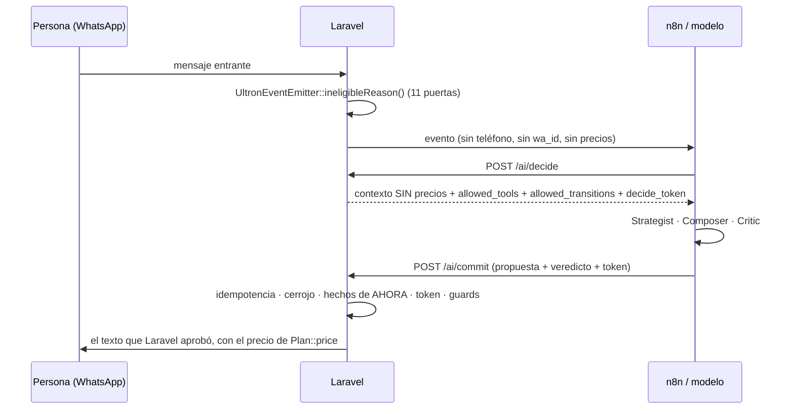

# ULTRON — Matriz de autoridad

**Qué es esto:** el documento de referencia que dice, decisión por decisión, **quién
propone y quién decide** en ULTRON, el asesor comercial por WhatsApp de IRON BODY.
No es una guía de operación (esa es
[`ULTRON_CANARY_RUNBOOK.md`](ULTRON_CANARY_RUNBOOK.md)) ni un tutorial: se lee por
búsqueda, no de principio a fin.

**Para quién:** quien toca el backend de Mercadeo, quien edita el workflow de n8n y
quien tiene que decidir si una salida a producción es segura.

**Fecha de la comprobación:** 2026-09-18. Comprobado contra el árbol de trabajo con
`HEAD = 97b2e73` (todo lo que se afirma aquí se leyó del código de ese estado o se
ejecutó contra él).

---

## 0. La frase, y por qué no basta con repetirla

El sistema entero descansa en una frase: **Laravel es autoridad; n8n y el modelo solo
proponen.** Esa frase está escrita en comentarios por todo el repositorio, y **ya se
demostró una vez que un comentario afirmaba una garantía que el código no daba**: el
comentario de `routes/marketing.php` decía que a n8n no se le daba autoridad sobre los
enlaces de pago, y el secreto interno sí se la daba. Esa asimetría se cerró en RC-2
(§6.1), y se cerró porque estaba ESCRITA: un test la sostenía en rojo hasta que alguien
decidiera.

Por eso este documento **no repite la frase: la demuestra con el código, y dice con la
misma claridad dónde no se sostiene**. La sección más importante es la §6, LÍMITES.

**Cómo se cita aquí:** archivo + **nombre** (clase, método, constante), nunca
`archivo:línea`. `UltronCommitService::execPaymentLink()` sobrevive a un refactor;
`UltronCommitService.php` con un número de línea, no. Donde lo citado no tiene nombre se dice contra qué
estado se comprobó.



---

## 1. La tabla de autoridad

Una fila por decisión. «Dónde vive» es la fuente de verdad que Laravel consulta; «si el
modelo propone otra cosa» es lo que ocurre **de verdad**, con su código.

| # | DECISIÓN | PROPONE | DECIDE | Dónde vive la decisión | Si el modelo propone otra cosa |
|---|---|---|---|---|---|
| 1 | **El precio que se dice** | Nadie: el modelo nunca ve una cifra (`UltronDecideService::plansWithoutPrice()` quita `price`) | Laravel | `Plan::price`, leído en el commit y sustituido en `{{PLAN_PRICE}}` por `UltronDraftPlaceholders::resolve()` | **422 `machine_reply_invented_price`**, sin efectos. Lo tira `OutboundContentGuard::inspect()` vía `assertSafe()`. Fijado por `UltronCommitTest::test_an_invented_price_in_the_draft_is_rejected()` y `Torture\MoneyAuthorityTortureTest::test_a_price_written_by_the_model_never_reaches_the_person()` |
| 2 | **Qué plan se cotiza** | **El modelo**, con `proposal.recommended_plan_id` | El modelo elige; **Laravel solo filtra** | `UltronCommitService::resolvePlan()` relee la fila; el menú sale de `MarketingKnowledgeBaseService::activePlans()` (filtrado por `Plan::scopeSellable()`) y el desempate genérico de `defaultMonthlyPlan()` | Si el id no existe → 422 `plan_not_found`; inactivo → 422 `plan_inactive`; no vendible → 422 `plan_not_sellable`. **Dentro del catálogo legal, elige el modelo** → §6.6 |
| 3 | **Si un plan es vendible** | Nadie | Laravel | `Plan::isSellable()` = `active` ∧ `sellable` ∧ `price > 0` ∧ `duration_days > 0`. Misma regla en `Plan::scopeSellable()` | 422 `plan_not_sellable` en `resolvePlan()`, y otra vez en `SalesPaymentGuardrailService::assertCanGeneratePaymentLink()` antes de cobrar |
| 4 | **Si hay enlace de pago y con qué monto** | El modelo **pide** la herramienta `payment_link_send` | Laravel | Permiso: `SalesPaymentReadinessService::canGenerateAutomaticLink()` = Wompi `production_ready` **Y** `marketing.ultron.payment_links_enabled`. Ejecución y monto: `UltronCommitService::execPaymentLink()` con `Plan::price` | Sin permiso **no hay 422**: la herramienta cae en `applied.tools_rejected` con warning `ultron.commit.tools_rejected`, y `execPaymentLink()` la vuelve a frenar con `skipped/automatic_links_disabled`. El contrato **no tiene campo de monto**: `amount`, `price`, `total` mueren como `unexpected_fields` |
| 5 | **Estado del pago** | Nadie | Laravel | `PaymentStatusProvider::forLead()` → `context.payment.state` ∈ `none·pending·approved·declined·expired`, solo sobre transacciones `mkt-lead-{id}-plan-%` del propio lead | El estado viaja resuelto. Afirmarlo al revés en el texto **no está cerrado**: el Critic lo juzga (`invented_payment_status`), pero no hay guard determinista → §6.7 |
| 6 | **Derivación a una persona** | El modelo, con `proposal.human_handoff_requested` / `human_handoff_reason` | Laravel | `UltronCommitService::autorizarHandoff()` sobre `HumanHandoffAuthority`. Tres hechos de Laravel: `conversation.human_takeover`, lead en `MarketingLead::STATUS_NEEDS_HUMAN`, o `HumanHandoffAuthority::peticionDeHumanoEn()` corroborado contra el texto real | **422 `unauthorized_handoff`** antes de cualquier efecto. El modelo solo puede proponer `explicit_human_request` (`HumanHandoffAuthority::MODEL_PROPOSABLE`); cualquier otro motivo → `handoff_reason_not_proposable_by_model`. Y si el texto lo ofrece igualmente → 422 `machine_reply_unauthorized_handoff` |
| 7 | **Marcar no-contactar** | El modelo, pidiendo `mark_do_not_contact` | Laravel ejecuta | `UltronCommitService::execMarkDnc()` escribe `do_not_contact`, `consent_status = denied`, `consent_source`, `consent_at` | Es la única herramienta que corre **aunque no haya respuesta**: `runTools()` va antes de comprobar `safe_to_send`, a propósito. Y el opt-out ya marcado gana sobre todo: `SalesAgentGuardrailService::apply()` devuelve `blocked_do_not_contact` |
| 8 | **Hechos del gimnasio** | Nadie | Laravel | `GymFactsProvider::forPrompt()` → clases con día y hora, `trainers.{active_count,specialties}` sin nombres, `opening_hours`; lo que el CRM no tiene va como `GymFactsProvider::SOURCE_NOT_AVAILABLE`, y `class_availability` **siempre** | El hecho inventado lo juzga el Critic (`invented_class`) → camino del Critic fallido. Una cifra dentro del hecho inventado suele caer antes como `machine_reply_invented_price` |
| 9 | **Hechos de la app** | Nadie | Laravel | `MobileAppCatalog::forPrompt()` (escrito desde el código de la app Flutter, no desde la BD); los enlaces los manda Laravel con `MobileAppCatalog::linksMessage()` en su propio mensaje | El modelo **no escribe URLs**: 422 `machine_reply_url`. Si pide `app_links_send`, Laravel lo envía y lo espacia `UltronCommitService::APP_LINKS_RESEND_MINUTES` (60) con `skipped/already_sent` |
| 10 | **Hechos de la membresía** | Nadie | Laravel | `MembershipFactsProvider::forPrompt()` → `status` ∈ `unknown·none·active·expiring·expired`, y solo con identidad (`lead.member_id`); lo que no resuelve el asistente va en `MembershipFactsProvider::TEAM_ONLY` | **422 `machine_reply_membership_fact`** (`MembershipFactGuard::contradiction()`), con motivo `expiry_unknown`, `expiry_mismatch`, `days_unknown`, `days_mismatch` o `status_mismatch`. Es determinista: sin socio identificado, **cualquier** fecha o cantidad de días afirmada se rechaza |
| 10.bis | **Día de cortesía** | El modelo propone día y hora en `courtesy_date` / `courtesy_time` | Laravel | `CourtesyAuthority::decide()` contra `gym.opening_windows` (la misma entrada aprobada del horario, en su `metadata`), y `CourtesyRequestService` escribe en `marketing_agent_actions` con `status=suggested`, que es donde ya vive «la IA propone, una persona aprueba». La cita real en `marketing_appointments` nace SOLO cuando el equipo la ejecuta | REGISTRAR NO ES AGENDAR: el agente nunca dice confirmado ni agendado. Fuera de horario, en el pasado o a más de noventa días no se registra y se dice por qué. Idempotente por conversación: cambiar de día actualiza la misma solicitud, y cancelar es un cambio de estado, nunca un borrado. Es la única herramienta además de la marca cuyo efecto autoriza decir «lo dejé registrado» sin que la invariante de promesas tumbe el turno. Las palabras «gratis» y «sin costo» siguen prohibidas por `machine_reply_invented_discount`: se dice «día de cortesía» |
| 11 | **Qué herramientas existen y cuáles puede pedir el modelo** | El modelo pide en `proposal.tools_requested` | Laravel | Vocabulario (forma): `UltronDecideService::TOOL_VOCABULARY` = `staff_review`, `mark_do_not_contact`, `app_links_send`, `payment_link_send`, `courtesy_request`. Menú del turno (permiso): `UltronDecideService::allowedTools()` = `V1_ALLOWED_TOOLS` + `payment_link_send` solo con permiso de pago | Un nombre fuera del vocabulario → **422 de validación** en el controlador (fail-closed). Un nombre del vocabulario **sin permiso hoy** → no es error: `UltronCommitService::allowedTools()` hace la **intersección**, nunca la unión, y lo descartado sale en `applied.tools_rejected`. Cuadrado por `Unit\Marketing\UltronToolVocabularyTest` |
| 12 | **La fase comercial siguiente** | **El modelo**, con `proposal.next_state` | El modelo elige; **Laravel solo acota el menú** | `CommercialPhaseMachine::allowedTransitions()` con los hechos de `UltronDecideService::phaseContext()`; el menú va firmado dentro del `decide_token` | Fuera del menú → 422 `illegal_transition`. Un menú que cambió entre decide y commit → 422 `stale_decision`. **Dentro del menú legal, elige el modelo** → §6.5 |
| 13 | **Si el mensaje se envía o no** | El modelo redacta | Laravel | `OutboundContentGuard::assertSafe()` + `ComposerStyleGuard::inspect()` + `NoveltyGuard::nearDuplicateOf()` + `CustomerIntelligenceService::isResell()` + `SalesAgentGuardrailService::apply()`; el envío lo hace `MarketingMessageDispatcher::dispatchWhatsapp()` | Dos familias distintas, y confundirlas es la trampa: contenido prohibido → **422 y nada se escribe**; repetición, reventa o guardrail → **200 con `outcome: no_reply`** y el turno **consumido** (§2.2) |
| 14 | **Enlaces y URLs** | Nadie | Laravel | Los enlaces salen en mensajes propios de Laravel (`execPaymentLink()`, `execAppLinks()`), que no pasan por el guard porque los compone el backend | Una URL en el borrador → **422 `machine_reply_url`**. `OutboundContentGuard::containsUrl()` deshace los disfraces habituales (`(.)`, «punto», «barra»). Además la URL del link de pago **no vuelve al modelo**: `UltronDecideService::redactedBody()` la sustituye en el historial |
| 15 | **El veredicto del Critic** | El modelo (bloque `critic`) | Laravel decide qué hacer con él | Vocabulario cerrado en `CriticContract::DIMENSIONS` (22) y `CriticContract::HARD_FAILS` (16); la lectura, en `CriticContract::isFail()` y `hardFailOf()` | Un valor fuera del enum → **422 de validación**, a propósito. Un `hard_fail` no nulo es `fail` **aunque el veredicto diga `pass`**: la contradicción se resuelve del lado que no envía. Un bloque ausente o todo en `null` **no se persiste como pass** (`CriticContract::judged()`) |

---

## 2. Los cerrojos con nombre

Todos los códigos con los que Laravel puede rechazar o frenar. **Están separados en dos
familias porque confundirlas es la trampa del catálogo**: unas abortan sin dejar rastro;
otras responden 200, consumen el turno y hacen que un reintento de n8n reciba 409.

### 2.1 Familia A — 422 y aborta (no se escribe nada, no sale nada)

Todos viajan como `{"ok": false, "code": ...}`. La excepción es
`UltronCommitException`, cuyo estado por defecto es 422.

| Código | Qué defiende |
|---|---|
| *(errores de validación del controlador)* | La **forma**: enums cerrados de fase, intención, herramientas, motivos de derivación y veredicto del Critic. Lo que no está en la lista blanca no llega al servicio |
| `unexpected_fields` | Un campo de más no se ignora en silencio: si el workflow empieza a mandar `phone` o `price`, falla la primera vez. Cubierto por `UltronCommitTest` y `UltronStrategistContractTest` |
| `already_committed` (**409**) | Idempotencia. La garantiza el índice UNIQUE de `marketing_ai_actions.idempotency_key`, no una comprobación lógica: dos procesos que pasan a la vez, y solo uno escribe |
| `not_found` (**404**) | La conversación o el mensaje ya no existen |
| `stale_decision` | La decisión se tomó sobre un mundo que ya cambió. `detail.reason` lo dice: `decide_token_missing`, `decide_token_malformed`, `decide_token_bad_signature`, `decide_token_expired`, `decide_token_conversation_mismatch`, `decide_token_message_mismatch`, `decide_token_phase_changed`, `decide_token_transitions_changed`, `decide_token_knowledge_changed` |
| `empty_reply_draft` | Una propuesta sin respuesta no es una propuesta |
| `unauthorized_handoff` | Derivar a una persona sin que Laravel lo autorice. Se comprueba **antes** de cualquier efecto: sin mensaje, sin acción, sin `staff_review_pending`, sin `human_takeover` |
| `illegal_transition` | La fase propuesta no está en el menú recalculado con los hechos de ahora |
| `unknown_placeholder` | Un marcador que Laravel no sabe sustituir. Los legales son `UltronDraftPlaceholders::ALLOWED` = `PLAN_PRICE`, `PLAN_NAME`, `PLAN_DURATION` |
| `machine_reply_card_data` | El borrador pide tarjeta, CVV, PIN, clave de banco u OTP. El cobro vive en el checkout de Wompi, **nunca** en el chat. Es lo primero que mira `inspect()`: es lo único de la lista que le cuesta dinero a la persona |
| `machine_reply_unauthorized_handoff` | El **texto** ofrece pasar a una persona sin permiso, aunque el campo no lo pidiera. Segunda barrera, por si algo se coló |
| `machine_reply_schedule_deferral` | El texto APLAZA el horario en una persona («el equipo te confirma el horario», «eso lo confirma una persona») sin que nadie haya pedido hablar con alguien. No es un traspaso —la conversación no cambia de manos— pero promete atención humana que nadie autorizó, y en WhatsApp se lee como «espera, que te escriben». Va acotado al HORARIO, que es el hecho que hoy falta de verdad: aplazar en el equipo el medio de pago o una gestión de membresía sigue siendo correcto, y eso lo juzga el Critic, que tiene el contexto del turno |
| `machine_reply_claims_confirmed_courtesy` | El texto da por CONFIRMADA una visita de cortesía que sólo está solicitada: «quedaste agendado», «tu cortesía quedó confirmada», «ya te reservé el cupo», «te esperamos el sábado». La confirma una persona del equipo, y afirmarlo manda a alguien a un gimnasio que no lo espera —un daño que ninguna disculpa posterior repara, porque el viaje ya está hecho—. No lo cubría nada: se midió que las tres formas que se escriben de verdad pasaban limpias por la invariante de promesas, que sólo cazaba «te agendo» en primera persona. Cae la FRASE, no el turno: se retira y sale el resto, o un texto curado. Si el equipo ya confirmó y existe la cita real en `marketing_appointments`, la frase es verdad y sale intacta |
| `machine_reply_denies_available_checkout` | El texto NIEGA que exista un enlace de pago —«no contamos con un link de pago», «no manejamos pagos en línea»— cuando el cobro SÍ está disponible: la autoridad lo permite en esta conversación, hay plan vendible y nadie ha pagado. Salió en un turno real del canario y costó la venta. Tiene dos caras: en `checkoutDecision()` la negación vale como PRUEBA de que a la persona le interesaba pagar —es el tercer testigo, y el borrador se sustituye entero por el texto curado con precio y enlace—; en `sinNegarUnCobroDisponible()` el hard fail es del BORRADOR y no del turno: se retira la frase que miente y sale el resto, o un texto curado si no quedaba nada. Lanzar 422 ahí dejaba el turno mudo con la fila de la acción ya escrita como ejecutada, de modo que el vigía no veía ningún turno sin desenlace y el freno del canario no se accionaba. Cuando el cobro NO está disponible, negarlo es verdad y sale sin estorbo |
| `machine_reply_forbidden_action` | El texto dice que va a activar una membresía, aprobar un pago o tocar facturación |
| `machine_reply_unsafe_claim` | Promesa de resultados o diagnóstico clínico |
| `machine_reply_invented_price` | Una cifra escrita por el modelo. **Este es el código real del precio inventado**, no `draft_rejected` (§2.3). Cuenta como cifra lo que un colombiano lee como dinero: «80.000», «80 mil», «ochenta mil», «80k», «80 000», dígitos de ancho completo y la O por cero |
| `machine_reply_invented_discount` | Una rebaja que el negocio no declaró: descuento, promoción, «mitad de precio», «gratis», «2x1». El precio lo pone el catálogo; las promociones también, o no existen (`OutboundContentGuard::CODE_INVENTED_DISCOUNT`) |
| `machine_reply_url` | Una URL escrita por el modelo. Los enlaces los pone Laravel en su propio mensaje |
| `machine_reply_membership_fact` | Una fecha, unos días, un estado de membresía o un «ya puedes entrar» que el CRM no respalda (`MembershipFactGuard::CODE`) |
| `machine_reply_payment_fact` | El borrador da por recibido un pago que el CRM no ve, o enseña que una captura vale como prueba (`PaymentFactGuard::CODE`). El estado viaja firmado en el token de decide: es la palanca de fraude más barata que hay por WhatsApp |
| `machine_reply_pressure` | Urgencia o escasez inventadas, culpa, vergüenza corporal o testimonios sin fuente (`ComposerStyleGuard::CODE_PRESSURE`). Lo ambiguo **no** aborta: va a `risk_flags` como `style:*` y se envía |
| `plan_required_for_placeholder` | El texto cotiza un plan y la propuesta no dice cuál |
| `plan_not_found` · `plan_inactive` · `plan_not_sellable` | El plan recomendado no existe, ya no está activo o no se le puede vender a nadie. **No se recalcula a otro plan en silencio**: sería contestar una recomendación que el modelo nunca hizo |
| `draft_rejected` | **Inalcanzable desde `/ai/commit`** (§2.3). Se conserva en el código como red por si el orden cambia |

### 2.2 Familia B — 200, `outcome`/`blocked_reason`, y el turno queda consumido

Esta familia es la que se malinterpreta. **Aquí no hay error**: la respuesta es 200, se
escribe una fila `MarketingAiAction` **con la clave de idempotencia** y la acción queda
en `skipped`. Consecuencia directa: **un reintento de n8n con la misma clave recibe 409
`already_committed`**, no otra oportunidad. Un bloqueo también es una decisión tomada
(`UltronCommitService::blocked()`).

**`outcome: blocked`** — los hechos duros, revalidados en el commit
(`UltronDecideService::ineligibleReason()`, más el adelantamiento):

| `blocked_reason` | Qué defiende |
|---|---|
| `lead_missing` | Una conversación sin lead no tiene a quién contestarle |
| `message_not_in_conversation` | El mensaje que se cita pertenece a otra conversación |
| `message_not_inbound` | No se contesta a un mensaje saliente |
| `message_not_from_lead` | No se contesta a lo que escribió la máquina o el equipo |
| `conversation_closed` | La conversación está cerrada |
| `do_not_contact` | La persona pidió que no le escribieran. Gana sobre todo lo demás |
| `human_takeover` | Hay alguien del equipo al mando (y `human_takeover_source = manual`) |
| `ai_disabled` | La IA está apagada en ese hilo |
| `superseded` | Llegó un mensaje más nuevo de la misma persona mientras se pensaba. Gana el último; los anteriores se descartan sin ruido. Lleva `superseded_by` |

**`outcome: no_reply`** — el texto no sale, pero **las herramientas del turno sí se
ejecutaron** (`runTools()` corre antes). `blocked_reason` es el `recommended_action` de
la decisión:

| `blocked_reason` | Qué defiende |
|---|---|
| `blocked_do_not_contact` | Opt-out detectado en el guardrail |
| `mark_do_not_contact` | La persona pidió no ser contactada: se marca y no se insiste |
| `repeated_reply` | El texto final es casi copia de una salida de las últimas 24 h (`NoveltyGuard`). Así se mandó seis veces el mismo precio a la misma persona. **La fase no avanza** |
| `resell_blocked` | Se le está cotizando a alguien el plan que ya tiene (`CustomerIntelligenceService::isResell()`). **La fase no avanza** |
| `guardrail_blocked` | Valor por defecto cuando el guardrail cerró el envío sin dar otro motivo |

**Camino del Critic fallido** (`handleCriticFailure()`), también 200 y también consumido:

| `outcome` | Qué pasó |
|---|---|
| `curated_fallback` | El borrador murió y salió un texto **curado de Laravel** (`SalesConversationReplyService::replyFor()`), que además pasa por `inspect()` y por la comprobación de repetición. `fallback_mode: SAFE_CURATED_REPLY`, `staff_review_reason: critic_failed` |
| `handoff` | No había texto curado utilizable: silencio + `staff_review_pending`. `fallback_mode: NO_REPLY_AND_HANDOFF`, `staff_review_reason: critic_failed_no_safe_reply` |
| `failed` | El despachador no pudo entregar. La acción queda en `failed` |

**Frenos a nivel de herramienta** — no abortan el turno, se anotan en
`applied.tools_executed` / `metadata`: `reply_not_sent`, `automatic_links_disabled`,
`no_plan_to_charge`, `no_lead`, `another_link_in_flight`,
`wompi_checkout_not_configured`, `already_paid`, `link_not_safe_to_send`,
`payment_engine_error` (link de pago); `already_sent`, `not_sent`, `app_links_error`
(enlaces de la app); y los de `SalesPaymentGuardrailService`:
`lead_do_not_contact`, `amount_not_allowed`, `plan_price_invalid`,
`plan_duration_invalid`. `execPaymentLink()` y `execAppLinks()` **nunca lanzan**: un
fallo ahí no puede romper un turno que ya salió.

### 2.3 El caso que este documento existe para aclarar: `draft_rejected` es inalcanzable

Es tentador decir que una cifra en el borrador «sale como `draft_rejected`», porque ese
código existe y su mensaje dice exactamente eso. **No es lo que pasa.**

En `UltronCommitService::execute()`, el paso 9 llama a
`OutboundContentGuard::assertSafe()` **antes** de `SalesAgentDecisionValidator::sanitize()`.
Y `sanitize()` solo anula `reply` por dos motivos —`containsPrice()` y
`unsafeSignalIn()`—, que son precisamente los dos que `inspect()` ya atrapó unas líneas
antes como `machine_reply_invented_price` y `machine_reply_unsafe_claim`.

Por tanto, **por ese orden, `draft_rejected` no puede alcanzarse desde `/ai/commit`**.
La comprobación: ningún test de la suite lo espera, y los que prueban el precio
inventado esperan `machine_reply_invented_price`
(`UltronCommitTest::test_an_invented_price_in_the_draft_is_rejected()`,
`Torture\MoneyAuthorityTortureTest::test_a_price_written_by_the_model_never_reaches_the_person()`).

Consecuencia práctica para quien edita n8n: **si buscas `draft_rejected` en los logs de
un turno rechazado por precio, no lo vas a encontrar.**

### 2.4 La puerta de entrada: antes de que exista ningún turno

Un mensaje que no pasa `UltronEventEmitter::ineligibleReason()` **no genera evento**, así
que no deja rastro en la cola y n8n ni se entera: `ultron_disabled`,
`not_canary_conversation`, `lead_missing`, `channel_not_supported`, `not_inbound`,
`not_from_lead`, `do_not_contact`, `human_takeover`, `ai_disabled`,
`reaction_not_actionable`, `no_readable_text`. Con `ultron_disabled` **ni se registra el
log**: una fila por cada mensaje mientras ULTRON duerme no sirve para nada.

`POST /ai/decide` aplica su propia puerta con los motivos de
`UltronDecideService::ineligibleReason()` y responde **422 `not_eligible`** con
`reason`; el adelantamiento responde **200 con `superseded: true`**, que no es un error:
es lo que pasa cuando alguien escribe tres veces en quince segundos.

---

### 2.4 El vocabulario del Critic, entero

Los dos enums son contrato con n8n: el schema del workflow y estas listas tienen que ser
idénticos, elemento a elemento. Un valor que n8n emita y el backend no conozca es 422 a
propósito; uno que el backend acepte y n8n no emita nunca es letra muerta que nadie
detecta. Por eso `UltronAuthorityMatrixTest` comprueba que el endpoint ACEPTA los 38.

**`CriticContract::HARD_FAILS` (16).** Con cualquiera de estos el veredicto es `fail`
aunque el modelo diga `pass`, y el turno toma el camino del Critic fallido:

`invented_price` · `invented_plan` · `non_sellable_plan` · `invented_class` ·
`invented_payment_status` · `invented_url` · `unauthorized_handoff` ·
`request_card_data` · `contradiction` · `major_reference_failure` · `low_novelty` ·
`customer_misfit` · `pressure` · `progressive_disclosure` · `identity_lie` ·
`invented_membership_fact`

**`CriticContract::DIMENSIONS` (22).** Las claves con las que el Critic puede señalar
qué falla, como máximo `MAX_ISSUES` por veredicto:

`relevance` · `empathy` · `naturalness` · `context_use` · `sales_judgment` ·
`pressure_control` · `next_step` · `question_discipline` · `repetition` ·
`phase_alignment` · `reference_resolution` · `novelty` · `customer_fit` ·
`progressive_disclosure` · `factuality` · `tool_consistency` · `memory_consistency` ·
`payment_safety` · `url_safety` · `app_factuality` · `handoff_leak` ·
`membership_factuality`

### 2.5 Los seis motivos de derivación, y cuál puede proponer el modelo

`HumanHandoffAuthority::ALLOWED_REASONS` tiene seis. **El modelo solo puede proponer
uno** (`MODEL_PROPOSABLE`), y aun ese lo corrobora Laravel contra el texto real de la
persona. Los otros cinco solo valen cuando los afirma el CRM:

| Motivo | Quién lo puede afirmar |
|---|---|
| `explicit_human_request` | El modelo lo propone; Laravel lo corrobora en el mensaje |
| `unresolvable_payment_incident` | Solo Laravel |
| `unresolvable_account_operation` | Solo Laravel |
| `formal_complaint_requiring_human` | Solo Laravel |
| `policy_required_escalation` | Solo Laravel |
| `critical_capability_not_available` | Solo Laravel |


### 2.6 El control humano tiene tres estados, y una salida oficial

Derivar no era un estado: era una marca, `lead.status = needs_human`, que escribía la
escalada del motor y que solo se borraba al soltar un traspaso. Un lead que el motor
escaló y que **nadie atendió nunca** se quedaba ahí para siempre, y como decide y commit
leen esa marca como «derivar está autorizado», el traspaso quedaba autorizado en TODOS
los turnos futuros, meses después, sin que nadie lo hubiera pedido. En producción había
dos leads así desde junio, y uno era el dueño de la conversación del canario.

Los tres estados los distingue un único sitio,
`MarketingManualTakeoverService::controlState()`:

| Estado | Qué significa | Cómo se sale |
|---|---|---|
| `HUMAN_REQUIRED` | Alguien pidió una persona y **nadie la ha tomado** | Que una persona la tome (`takeover`) o la devolución oficial |
| `HUMAN_ACTIVE` | Una persona **tiene la conversación en la mano** (`human_takeover`) | Solo la devolución oficial |
| `RELEASED_TO_AI` | El asistente responde | — |

**Mientras `HUMAN_ACTIVE` esté activo, la autoridad es de la persona, entera.** El
asistente no escribe aunque el motor crea que debería.

La salida oficial es `releaseToAi()`, expuesta como
`POST /api/admin/marketing/conversations/{id}/release-to-ai` (capacidad `CAP_RELEASE`,
motivo obligatorio). Deja una fila `release_to_ai` en `marketing_ai_actions` con
`from_state`, `to_state`, el actor y el motivo, y **no reabre el contacto**: un
consentimiento retirado sigue mandando, lo fija
`LeadNeedsHumanLifecycleTest::test_releasing_to_ai_never_overrides_a_withdrawn_consent()`.
Si otra conversación del mismo lead sigue en manos de una persona, la marca del lead
**no** se cierra.


## 3. Dos puertas, un filtro

Por el backend sale texto de máquina por **dos puertas**, y desde este cierre comparten
filtro de verdad:

- `POST /api/internal/marketing/send-message` (vive en `routes/api.php`)
- `POST /api/internal/marketing/ai/commit`
- y la salida **curada** del Critic fallido, que es la que ya se coló una vez por no
  mirarse.

El filtro común es `OutboundContentGuard::inspect()`, y su orden es por gravedad:
`containsCardDataRequest()` → oferta de traspaso → acción prohibida → afirmación
insegura → precio → `containsUrl()`.

**Lo que cambió:** hasta este cierre, la petición de datos de tarjeta y las URLs solo las
comprobaba `commit`, por separado, antes de llamar al guard. Resultado: por
`send-message` salía un enlace que nadie había verificado, y por la salida curada
también. Hoy las dos viven dentro de `inspect()`, y por tanto valen para las tres
salidas. Está fijado por
`InternalSecretAuthoritySurfaceTest::test_both_doors_share_the_same_filter()`.

Dos detalles que se olvidan:

- **El filtro es por autor, no por canal.** `ai` y `system` se filtran
  (`OutboundContentGuard::MACHINE_SENDERS`); `human` no, porque un asesor **puede**
  citar un precio: es su trabajo.
- **`send-message` fija el autor en máquina** y no lo acepta del request, que es lo que
  impide saltarse el filtro declarándose humano
  (`InternalSecretAuthoritySurfaceTest::test_that_door_always_writes_as_a_machine_whatever_the_caller_claims()`).

---

## 4. El contrato n8n↔backend

### 4.1 Qué viaja en cada sentido

**Laravel → n8n (evento de entrada, `UltronEventEmitter::payload()`).** Lo mínimo:
`event_id`, `message_id`, `meta_message_id`, `conversation_id`, `contact_id`,
`direction`, `message_type`, `text`, `timestamp`, `channel`. **Sin teléfono, sin wa_id,
sin nombre completo.** Lo que no viaja no se filtra.

**Laravel → n8n (`POST /ai/decide`).** `decision` (la del cerebro local), `context`
(`lead` sin PII, `memory.structured`, `resolved_reference`, `novelty`, `customer`,
`payment`, `strategy_hints`, `recent_messages` redactados, `knowledge_base`,
`active_plans` **sin `price`**, `gym`, `app`, `membership`, `default_plan_id`, `flags`),
`commercial_phase`, `allowed_transitions`, `allowed_tools`, `knowledge_version`,
`decide_token` y `expires_at`. El token dura `UltronDecideToken::TTL_SECONDS` (120) y
firma conversación, mensaje, fase, huella de las transiciones, versión del conocimiento
y las `strategy_hints` que decide emitió.

**n8n → Laravel (`POST /ai/commit`).** `source_type`, `source_event_id`,
`idempotency_key`, `conversation_id`, `decide_token`, el bloque `proposal` y el bloque
`critic`. **Ningún campo de autoridad de negocio existe en el contrato**: no hay
destinatario, ni precio, ni monto, ni URL, ni estado de pago, ni activación de
membresía. No es que se validen: **es que no se pueden expresar**, y un campo de más
muere como `unexpected_fields` antes de tocar el servicio
(`UltronController::unexpectedKeys()`).

**n8n → Laravel (`POST /ai/ultron/incidents`).** El parte de avería, deliberadamente
pobre: `workflow_execution_id`, `stage` (de una lista cerrada), `error_code`,
`retryable`, `occurred_at` y los ids. **Ni el mensaje del cliente, ni cabeceras, ni
trazas**: un parte que arrastra el texto de la conversación convierte el panel de IRON
GUARD en un segundo sitio donde vive la PII.

### 4.2 Qué versión del workflow exige qué backend

Workflow: `Iron Body - ULTRON - Commercial Advisor` (`YspRwsXnqt33NouP`). La cadena, en
orden. **Un backend anterior al que exige la versión publicada rechaza TODOS los commits
con `unexpected_fields` 422**, porque la validación es fail-closed sobre la forma: no
falla un turno, falla el sistema entero.

| Bloque | `activeVersionId` de n8n | Backend mínimo | Qué se rompe con uno anterior |
|---|---|---|---|
| Cerrojo de derivación | `2a0b17a3-ed15-477c-bcdd-de65cb0b7bac` | **`5d6d793`** (prod al cerrar: `a1249aa`) | `unexpected_fields` en **todos** los commits: los tres campos `proposal.human_handoff_*` no existían |
| Memoria conversacional | `04a11515-25fc-4173-bff8-452760ae9e0d` | `1e2b021` (migración `2026_09_17_060000`, columna json `marketing_conversations.memory`) | `context.resolved_reference`, `novelty` y `memory.structured` llegan `undefined`: no rompe, el modelo pierde el referente |
| Perfil de cliente | `f6ca3b81-29a6-4aaf-9259-8b0fe3ca861d` | `73c7145` | `context.customer` llega `undefined` (no rompe) |
| Strategist Omega | `f0d3856a-cc78-4956-bac7-54f7205ded1e` | `6155378` | `unexpected_fields` en todos los commits |
| Composer Omega | `316f3b06-8ddd-4539-8a3b-43bf15e8dfb6` | **`3e5cf63`, no `ffda41d`** | `ffda41d` introdujo `ComposerStyleGuard` con `\p{Extended_Pictographic}`, que el PCRE 10.39 de producción **no compila**: cada `inspect()` lanza `ErrorException` |
| Critic Omega | `0561aa01-fd2f-4249-b330-d71b52a2a49f` | `efe51b2` | `unexpected_fields` en todos los commits |
| Hechos del gimnasio | `39802f7c-fdd0-4bdf-99d6-2e5ea4101521` | `75e068b` | `context.gym` llega `undefined` (no rompe) |
| Motor de pagos Wompi | `83524560-558f-4eb5-94ff-d29dd0ea1a55` | `099d79e` | 422 por vocabulario: `payment_link_send` no estaba en `TOOL_VOCABULARY` |
| Estado del pago | `252a650e-dbcd-468d-86e2-b36facf7ecd9` | `ee47d37` | `context.payment` llega `undefined` (no rompe) |
| Pago → membresía → inicio | *(no requiere cambios en n8n)* | `9f44f08` | — |
| Inteligencia de la app | `19ef9c2b-eb8f-46af-b200-5048d82150c2` | `32b21a0` | 422 por vocabulario: `app_links_send` no estaba en `TOOL_VOCABULARY` |
| **Asistente posventa (vigente)** | `7d8477e9-44f9-4862-a023-2becb4f91ed6` | **`86fb788`** | Los enums del Critic suben a 22 `issues` (+`membership_factuality`) y 16 `hard_fail` (+`invented_membership_fact`): un backend anterior los rechaza con 422 de validación |

**Regla de despliegue, en las dos direcciones:** al desplegar **o revertir** cualquiera de
las dos mitades, se comprueba el par. Revertir el backend por debajo del mínimo con el
n8n publicado deja a ULTRON sin poder contestar nada.

**La sonda sin efectos secundarios** (no crea filas: falla en la validación, antes de
tocar el servicio):

```bash
# Contra producción. Es de SOLO LECTURA: el body es deliberadamente inválido.
curl -sS -X POST https://api.ironbodyneiva.cloud/api/internal/marketing/ai/commit \
  -H "Authorization: Bearer <SECRETO_INTERNO>" \
  -H 'Content-Type: application/json' \
  -d '{"source_type":"x","proposal":{"human_handoff_requested":true,
       "human_handoff_reason":"explicit_human_request","human_handoff_evidence":"x"}}'
```

Lo que debe verse: **422 de validación pura**, **sin** `"code":"unexpected_fields"` y sin
errores en las claves `human_handoff_*`. Si aparece `unexpected_fields`, el par está
desparejado. El secreto se obtiene de `AUTOMATION_INTERNAL_SECRET` en el `.env` del
servidor; **no se copia a ningún documento ni a ningún ticket**.

---

## 5. Las banderas

Leídas de `config/`. **El valor efectivo lo fija el entorno** (`.env` del servidor, más
`php artisan config:cache`): lo que aparece abajo es el **default del código**, no lo que
hay puesto hoy. El estado verificado del servidor vive en
[`ULTRON_CANARY_RUNBOOK.md`](ULTRON_CANARY_RUNBOOK.md) §3, que es la fuente para eso.

| Clave de config | Variable de entorno | Default **en el código** | Qué gobierna |
|---|---|---|---|
| `marketing.ultron.enabled` | `MARKETING_ULTRON_ENABLED` | `false` | El interruptor. Apagado, `UltronEventEmitter` cierra la puerta 1 y no se crea ningún evento |
| `marketing.ultron.payment_links_enabled` | `MARKETING_ULTRON_PAYMENT_LINKS_ENABLED` | `false` | El **permiso del negocio** para acuñar un cobro. Es una pregunta distinta de la que responde Wompi: capacidad técnica **y** permiso, o no hay link. Desde RC-2 gobierna **todos** los caminos —también el panel humano y los endpoints internos—, no solo la herramienta de ULTRON (§6.1) |
| `marketing.ultron.canary_conversation_id` | `MARKETING_ULTRON_CANARY_CONVERSATION_ID` | `null` (sin restricción) | Con un id, ULTRON atiende **esa** conversación y ninguna otra (`not_canary_conversation`). Palanca de transición, no parte del diseño |
| `marketing.ultron.webhook_url` | `MARKETING_ULTRON_WEBHOOK_URL` | `null` | Adónde se despacha el evento. Se firma con `automation.webhook_secret` |
| `marketing.ultron.timeout` | `MARKETING_ULTRON_TIMEOUT` | `10` (s) | Timeout hacia n8n |
| `marketing.inbound.auto_analyze` | `MARKETING_INBOUND_AUTO_ANALYZE` | **`true`** | El **cerebro local** sobre los entrantes. Ver el aviso de abajo |
| `marketing.inbound.meta_enabled` | `MARKETING_INBOUND_META_ENABLED` | `true` | Procesar entrantes de Meta; si `false`, el webhook solo registra |
| `marketing.agent_enabled` | `MARKETING_AGENT_ENABLED` | `false` | Interruptor general del agente comercial (herramientas reales) |
| `meta.enabled` | `META_ENABLED` | `false` | Entrega real a Meta. Apagado, todo sale en `dry_run`: el mensaje se compone y se guarda, pero no se entrega |
| `wompi.env` | `WOMPI_ENV` | — | Junto al Web Checkout, decide `SalesPaymentReadinessService::state()`: `production_ready`, `sandbox_pending` o `not_configured` |
| `automation.internal_secret` | `AUTOMATION_INTERNAL_SECRET` | `null` | **El bearer de todo `internal/marketing/*`.** Ver §6.1 |

> **Aviso sobre `auto_analyze`: el default del código es `true`, no `false`.**
> Decir «está apagado» es falso a nivel de código; lo que está apagado es el **valor del
> servidor**. Lo que impide de verdad que convivan los dos cerebros es
> `AppServiceProvider::guardUltronConfig()`: con `ultron.enabled` **y** `auto_analyze`
> activos a la vez, **en producción lanza `RuntimeException` al arrancar** (fuera de
> producción, solo un `Log::warning`). Se comprueba al arrancar y no al primer mensaje,
> porque el primer mensaje ya sería el daño: dos respuestas a la misma persona, dos
> decisiones escritas y la memoria a merced de cuál termine antes.

---

## 6. LÍMITES — dónde termina de verdad la autoridad de Laravel

Esta es la sección que hace útil al resto. Todo lo de aquí está **verificado**; no son
sospechas.

### 6.1 El secreto interno abre más puertas que las dos de ULTRON (y ya no acuña dinero)

El diseño se cuenta así: «n8n solo tiene dos puertas, `ai/decide` y `ai/commit`». **Eso
es cierto del WORKFLOW; no lo es del SECRETO.** `automation.internal_secret` abre **todo**
el grupo `internal/marketing/*`, y ahí viven desde la Fase 1.5 dos endpoints de enlaces
de pago:

- `POST /api/internal/marketing/payment-links`
- `POST /api/internal/marketing/payment-links/send`

**Hasta RC-2 ninguno de los dos consultaba `marketing.ultron.payment_links_enabled`**:
apagar la bandera detenía la herramienta de ULTRON, no esta superficie, y quien tuviera
el secreto acuñaba un cobro real con la bandera apagada. En producción eso no era
teórico: Wompi está productivo con llaves reales.

**Cerrado.** El permiso se comprueba ahora en el EMBUDO —
`WompiPaymentLinkService::generateForLead()`—, por el que pasan los cinco caminos que
pueden acuñar: los dos endpoints internos, el panel del CRM, la herramienta de ULTRON,
el orquestador legado y la herramienta del subsistema Commercial. La regla vive en
`SalesPaymentGuardrailService::assertCanGeneratePaymentLink()` y es absoluta: con la
bandera apagada **no hay camino** que cree, reutilice o refresque un enlace, tampoco una
sesión real de administrador. Un rechazo no deja fila de cobro.

Lo que el secreto SIGUE abriendo, y hay que seguir teniendo escrito: el resto de
`internal/marketing/*` con una sola llave compartida, incluida la base de conocimiento
—acotada en RC-4 a PROPONER borradores que no llegan al prompt sin aprobación— y la
puerta por la que entra texto de máquina hacia el cliente (§6.3).

Fijado por
[`tests/Feature/Marketing/PaymentLinkHardGateTest.php`](../../tests/Feature/Marketing/PaymentLinkHardGateTest.php)
—los cinco caminos, el embudo, el enlace ya acuñado y el reverso con la bandera
encendida— y por
[`tests/Feature/Marketing/InternalSecretAuthoritySurfaceTest.php`](../../tests/Feature/Marketing/InternalSecretAuthoritySurfaceTest.php),
donde los dos casos que documentaban el agujero documentan hoy su cierre.

**Encender la bandera devuelve el cobro por todos esos caminos**: es una línea del
entorno, y esa decisión sigue siendo del dueño del producto.

### 6.1.b El horario no existe, y no se puede aplazar en nadie

`gym.opening_hours` vale `SOURCE_NOT_AVAILABLE` en producción: el único ítem de
horario de la base de conocimiento era un marcador sin horas, y se **rechazó**
en la revisión previa al canario. Mientras siga así, la respuesta honesta es
decir que el dato no está confirmado y seguir con lo que sí existe —las clases
llevan día y hora reales en `gym.classes`—.

Lo que NO vale es aplazarlo en una persona. El modelo lo hacía porque se lo
decían las dos capas: el prompt del Composer («di que ese dato lo confirma una
persona del equipo») y el propio backend, cuyo texto para
`SalesIntents::SCHEDULE_QUESTION` empezaba por ahí. Las dos se corrigieron, y
`machine_reply_schedule_deferral` lo frena si el modelo insiste.

**Con la derivación autorizada la regla no aplica**: si la persona pidió hablar
con alguien, que el equipo le confirme el horario es exactamente lo que toca.

### 6.2 El cerebro legado sí ve precios

`UltronDecideService::plansWithoutPrice()` quita `price` del catálogo que ve ULTRON, y
esa es la razón de que el modelo no pueda escribir una cifra «de memoria». **El cerebro
legado no tiene ese filtro**: `SalesAgentPromptBuilder` construye su prompt con
`MarketingKnowledgeBaseService::activePlans()`, que **sí incluye `price`** (y
`original_price`).

Los dos cerebros **no pueden convivir** —lo impide `AppServiceProvider::guardUltronConfig()`,
fatal en producción (§5)—, así que hoy no hay dos agentes viendo cosas distintas a la
vez. Pero **la asimetría existe**, y conviene saberla: la garantía «el modelo nunca ve
una cifra» es una garantía **de ULTRON**, no del backend.

### 6.3 El guard de precios mira dígitos, no dinero

`SalesAgentDecisionSchema::PRICE_PATTERN` reconoce separador de miles pegado a tres
dígitos, o cuatro dígitos seguidos. **No reconoce**, y por tanto **sale tal cual hacia la
persona**:

- el precio en letras («ochenta mil»), abreviado («80 mil», «80k»);
- el separador por espacio («80 000»), los dígitos de ancho completo, la `O` por cero;
- **el descuento sin cifra**: «te hago un descuento del 20%», «te dejo la mitad del
  valor». Nadie autorizó rebajar el plan y el texto sale igual.

Fijado —como comportamiento **no deseable**, a propósito, para que el día que se corrija
la corrección se note en rojo— en
`Torture\MoneyAuthorityTortureTest::test_a_price_the_model_spelled_out_is_not_recognised_as_a_price()`,
`test_a_price_with_an_unusual_thousands_separator_is_not_recognised_either()` y
`test_a_discount_nobody_authorised_is_not_recognised_as_money()`.

### 6.4 El precio es del `id`, no del plan que el texto nombra

`resolvePlan()` lee la fila de `proposal.recommended_plan_id` y sustituye
`{{PLAN_PRICE}}` con **ese** precio. **Nadie comprueba que el nombre que el modelo
escribió en prosa sea el mismo plan.** La persona puede recibir el precio del trimestral
atribuido al mensual
(`Torture\MoneyAuthorityTortureTest::test_the_quoted_price_belongs_to_the_id_and_not_to_the_plan_the_draft_names()`).

Y un marcador a medias —`{{PLAN_PRICE` sin cerrar— **no lo sustituye nadie y no lo
rechaza nadie**: el cliente lee la plantilla rota
(`test_a_half_written_placeholder_travels_to_the_person_as_it_is()`).

### 6.5 La FASE la elige el modelo; Laravel solo acota el menú

`CommercialPhaseMachine::allowedTransitions()` calcula **qué transiciones son legales**
con los hechos de Laravel, y `canTransition()` rechaza lo que esté fuera con 422
`illegal_transition`. **Dentro de ese menú, la fase la elige el modelo** con
`proposal.next_state`, y Laravel la escribe en `conversation.commercial_phase` sin
discutirla.

**No es un defecto: es el final real de la autoridad.** Laravel garantiza la legalidad de
la transición, no su acierto comercial.

### 6.6 El PLAN que se cotiza lo elige el modelo; Laravel solo lo filtra

Igual que la fase. Laravel garantiza que el plan **exista, esté activo y sea vendible**
(§1, fila 2), y le da al modelo un desempate para la pregunta genérica
(`default_plan_id`, de `defaultMonthlyPlan()`), pero **qué plan se le recomienda a esta
persona lo decide el modelo**. Hay cuatro planes activos de 30 días: la elección no se
deduce del catálogo.

### 6.7 Lo que el Critic juzga pero ningún guard determinista frena

Hay afirmaciones que **solo** vigila el Critic, es decir, un modelo juzgando a otro
modelo. Si el Critic falla, salen:

- **Declarar un pago que el CRM no ve**: «ya recibimos tu pago, quedas activo desde hoy».
  No es ninguna de las señales prohibidas y el mensaje sale
  (`Torture\MoneyAuthorityTortureTest::test_a_draft_that_declares_a_payment_the_crm_cannot_see_still_goes_out()`).
- **Aceptar una captura como prueba de pago**: «mándame la captura del comprobante».
  Es la puerta por la que una captura editada pasa por pago
  (`test_a_draft_that_accepts_a_screenshot_as_proof_still_goes_out()`).
- **Prometer un enlace que no puede existir**: con el motor de pagos apagado, la
  herramienta se cae (`automatic_links_disabled`) pero **el texto que promete el link
  sale igual**, y la persona queda esperando
  (`test_a_link_promised_in_the_draft_goes_out_even_when_no_link_can_exist()`).
- **El enlace en vuelo reutilizado**: conserva el monto con el que se creó, mientras la
  respuesta cotiza el precio de **ahora**. En el mismo turno salen dos cifras distintas y
  se cobra la vieja (`test_a_reused_link_keeps_the_old_amount_while_the_reply_quotes_the_new_price()`).

El Critic tiene códigos para casi todo esto (`invented_payment_status`, `invented_url`),
pero **un veredicto es una propuesta más**: `CriticContract::isFail()` decide qué hacer
con él, no si es cierto.

### 6.8 Lo que el veredicto del Critic no puede hacer

Conviene decirlo por el otro lado, porque es la mitad tranquilizadora: **un `pass` del
Critic no autoriza nada**. El borrador aprobado sigue pasando por `assertSafe()`, el
guard de tono, el de membresía, la novedad, la reventa y los guardrails. El veredicto
solo puede mover el flujo **hacia** el fallback curado, nunca hacia el envío.

### 6.9 Residuos conocidos

- **Concurrencia entre dos conversaciones del mismo lead.** El cerrojo es
  `marketing:conversation:{id}`: protege una conversación, no un lead con dos hilos
  abiertos. Pendiente de revisar **antes** de encender los enlaces de pago.
- **El canario no mide concurrencia ni coste por turno** (ver
  [`ULTRON_CANARY_RUNBOOK.md`](ULTRON_CANARY_RUNBOOK.md) §9).
- **`ProtocolAuthorityTortureTest` contiene sondas con `dump()`**, no aserciones: no
  cuenta como cobertura de nada.

---

## 7. Qué mantiene honesto a este documento

`tests/Feature/Marketing/UltronAuthorityMatrixTest.php` lee **este archivo** y afirma que
menciona cada valor de `UltronDecideService::TOOL_VOCABULARY`, cada
`CriticContract::HARD_FAILS`, cada `HumanHandoffAuthority::ALLOWED_REASONS`, cada
constante `CODE_*` de `OutboundContentGuard`, más `ComposerStyleGuard::CODE_PRESSURE` y
`MembershipFactGuard::CODE`.

**Añadir un cerrojo sin documentarlo pone el test en rojo.** Es lo que convierte esta
matriz en algo defendido y no en prosa que envejece.

Lo que **no** se comprueba aquí porque ya está cubierto en otro sitio, y se cita en vez
de reescribirse:

| Garantía | Dónde está fijada |
|---|---|
| `active_plans` viaja sin precio | `UltronDecideTest`, `UltronPriceRedactionTest` |
| `unexpected_fields` sobre la forma | `UltronCommitTest`, `UltronStrategistContractTest` |
| El menú de transiciones legales | `CommercialPhaseMachineTest` |
| `HUMAN_HANDOFF` fuera de `ALWAYS_REACHABLE` | `CommercialPhaseMachineTest`, `UltronHandoffHardGuardTest` |
| Los tres vocabularios de herramientas encajan | `Unit\Marketing\UltronToolVocabularyTest` |
| El RECHAZO de un enum desconocido del Critic | `UltronCriticContractTest` |
| Qué abre el secreto interno | `InternalSecretAuthoritySurfaceTest` |
| Que **ningún** camino acuña un cobro con la bandera apagada | `PaymentLinkHardGateTest` |
| Que lo escrito en la base de conocimiento no publica solo | `KnowledgeTrustBoundaryTest` |
| Que un traspaso viejo no autoriza todos los turnos futuros | `LeadNeedsHumanLifecycleTest` |
| Que la referencia de un cobro de pasarela es única en la base | `Payments\PaymentReferenceIdempotencyTest` |
| El precio inventado no llega a nadie | `UltronCommitTest`, `Torture\MoneyAuthorityTortureTest` |
